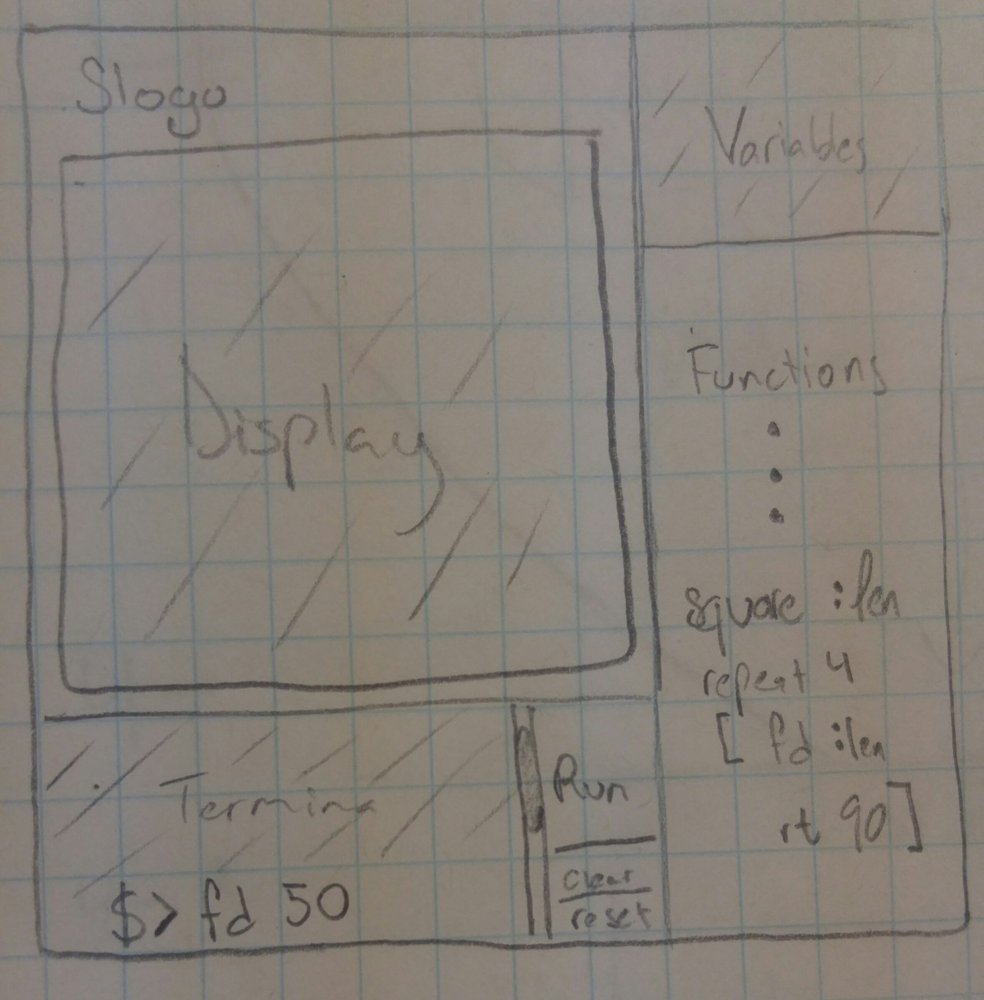

# DESIGN

## Introduction

We are writing a program that allows users to run Logo commands on a read-eval-print routine that controls the movement of a turtle object on a display. The primary design goal of the project is provide a flexible and extensible environment that allows built-in as well as user-defined commands and properties.  The primary architecture consists of three parts: the view component manages the graphical interface of the program, the controller component manages the application flow and parses command input, the model component processes parsed input by applying commands on the turtle and sends back updated information to be displayed by the view component. 
	
The implementations of basic commands should be closed to modification, but the program is open to user-defined commands that are built up on the basic ones. The program is also open to extension to graphical and user experience features (languages, turtle colors, icons,...)

## Design Overview

The program consists of four major classes: Controller, Model, GUI, and Parser. 
	
Controller is instantiated by Main.java and controls the overall flow of the program. It retains references to Model, GUI, and Parser in order to pass information back and forth between the various components of the program. 

GUI holds the various graphical components of the program such as the turtle display and the terminal. It has a public method step that Controller calls to update the attributes of the turtles as well as variables on screen. GUI passes the user input from the terminal to the Controller as a String.

After receiving the user input as a String, Parser is responsible for transforming the String into commands that the backend can use. Parser’s internal API, the Compiler decipher commands into a queue of turtle commands and also has a storage instance from the Model which allows it to remember and update functions and variable values.

The parser passes back the map of turtle commands to the controller, which it will use to call the step function of the Model. The step function of the model gets a map of turtle to a single command to be executed for every step, and the model will send back the updated turtles' properties and updated user-defined functions and variables to the GUI for display. 

**The following image is a rough sketch of out design:**

 

## User Interface

**GUI and User Interaction**

The main user interaction with the program will consist of entering commands in the terminal. The terminal will allow the user to add turtles, move them, and create functions with multiple commands. 

When the user creates a valid function, it gets added to the bottom-right-side panel for easy viewing. When the user defines variables for later use in the program, they get added to the variables box on the top-right-side panel.

On the right side of the terminal will be 3 buttons, run, clear, and reset, from top to bottom respectively. The run button executes the string that the user input into the terminal. Clear button clears the terminal, but not the display, saved functions, or saved variables. Reset clears everything and resets the model and GUI. All saved functions, variables, and GUI components are set to the way they were when the program was first opened. 

The following image is a rough sketch of the placement of the GUI componenets.
 

**User Errors**
The most common error will be syntax error or an error relating to the terminal. Other types of errors may include run-time errors such as those caused by an infinite loop. In any case, all errors will be displayed to the user in the form of a popup with the error message.

## API Details

### GUI
 
#### External API: 

1.
	
	public void step(list<TurtleAtrributes>)

This method is used by controller to pass in the new attributes of turtles for GUI to update the display. Example: view.step(model.step(nextCommands))

2.
GUI also needs to pass the user input to the controller in the form of a string. GUI will call a handler that is defined in Controller whenever it wants to delegate a task upwards. In this example, ControlHandler is defined in Controller and passed to GUI during initialization. 
	
	public interface ControlHandler{
		public handleTextInput(String input);
		public handleReset();
	}
Example use of ControlerHandler in GUI:

	private void runCommands(String newValue){
		this.controlHandler.handleTextInput(newValue);
	}

3.
In addition, GUI needs to receive text output in various cases such as when defining variables. GUI will have the following method that Controller can use to send this information:

	public void sendTextOutput(String output)

This method will display the output into the terminal. 
Example case 1: The user types x is 5 and hits enter. terminalDidChange is called with the String “x is 5”. After the controller parses the String, it calls sendTextOutput. This method prints a newline in the terminal with “x = 5” and writes the variable in the VariablesBox.

4.
Error Handling: Controller will call the following method for any type of error. 
	
	public void displayErrorWithMessage(String e)

5.
Lastly, the reset button must be able to communicate with Controller. Like the text input handler, reset 

	public void reset(){
		this.controlHandler.handleReset()
		//handle GUI reset
		...
	}

#### Internal API:

	
TerminalBox
	
		public void update(List<String> newLines)

TurtleDisplay
	
	public void update(List<TurtleAttributes> t)

ErrorPopup
	
	public void displayErrorWithMessage(String e)

VocabBox
	
	public void update(List<String> newFunctions)
	
VariablesBox

	public void update(List<String> newVars)

### CONTROLLER:

#### External API:

**Controller Interface:**

	Public void reset()

Resets the GUI and the back-end Model if the user calls reset 

#### Internal API: 

See Parser 

### MODEL

#### External API:

**Model Interface:**
 
 
	 public Object getUpdatedTurtle() 

This method is used by the Controller to get the updated turtle from the back end (in a format the GUI understands), which it will then pass to the front end. 

	public Object getStringOutput()

This method is used by the Controller/ GUI to get String output to be displayed on the console at every step. 

	public Object getStorage() 

This method is used by the Controller class to get user-defined logo commands and variables that currently are “valid” in the back end

	public Object step(Map<Integer,Command>)

This is used by the main control class in the back end to apply command objects to the Turtles 

**Storage Interface:**

Storage is going to be responsible for storing custom variables and custom functions input by the user. In order to implement the API, one sends in Maps in which correspond to the custom definitions. Also, the API will allow you to check if a variable already exists. This helps for checking whether or not someone is trying to call a function they never initialized. The same applies for variables. 

	public boolean addVariable(Map<String varName, int value>);
Adds the variable if it doesn’t already exist. If it does already exist, then it overwrites it. In the form of an integer.

	public boolean addFunction(Map<String functionName, List<Commands>);
Adds the function if it doesn’t already exist. If it does already exist, then it overwrites it. IN the form of a List containing the commands. 

	public void removeVariable(String)
	public void removeFunction(String)
	
	public boolean hasVariable(String varName);
Returns whether or not the that variable has ever been saved in the Storage API.

	public boolean hasFunction(String functionName);
Returns whether or not the that function has ever been saved in the Storage API. 

	public List<Commands> getFunction(String functionName);
Returns the List of commands that correspond to the functionName. Should throw an error if the function doesn’t exist. 

	public int getVariable(String varName);
Returns the int that correspond to the variable name passed in. Should throw an error if the variable doesn’t exist.

#### Internal API: 

**Command Interface:**

The command interface provides a structural implementation for each of the command classes. These classes of commands will inherit and provide an implementation to the execute method. This method will be called by the model interface which knows what commands to be executed from parsed user input. The command interface will provide the frame for two types of commands: the turtle commands that have direct effect on the turtle object (movement, tracing, etc.), and the operation commands which deals with expressions, math operations, boolean operations). The former will need an instance of the turtle object, the latter may need instances of other command classes. The execute method always returns a double value, as required by the specifications. 

	public double execute()

This interface makes it convenient to add more basic command by writing a new class that implements the interface. What is needed for the execute method to work on can be defined in the constructor of the new class, depending on the type of the command. 

**Turtle Interface: **

The turtle interface defines the Node object that the model interface will instantiate and apply commands on. 
	
	public int getId()
	public double getX()
	public double getY()
	public getHeadingAngle()
	public boolean getPen()
	public Collection getCharacteristics()
	public double setX()
	public double setY()
	public setHeadingAngle()
	public setPen()

Turtle class that implements this interface can extend by adding more methods for shape, icon, color, pen color, etc. these methods will be used by the view component classes which deals with the aesthetics of the turtle. 

### PARSER:

#### External APIs: 

**SLogoParser():**

The SLogoParser will be the main external API for parsing. The API will allow for the user to send in a string to parse. This API is integral to the SLogo program because it allows for the conversion from string into commands. Without this, the program would not be able to interpret user input. Will throw an error if you pass in an empty string to be parsed.

	public Map<int i.d., Queue <Commands>> parse(String toParse, Storage store);
This takes in a string input as well as known variables and functions. It then internally handles parsing this into the Logo commands. 

#### Internal APIs:

**Compiler**

The compiler is responsible for turning the Commands into a Queue of commands to execute. It should account for the loops contained in the Logo code for example. There should be no loop statements in the queue returned. Returning a map allows for the API to be extended to multiple turtles. 

	public Map<int id, Queue<Commands>> compile(List<Commands>, Storage store);
	
Takes in a list of commands and turns it into a queue of commands. Can be extended to account for multiple turtles by using a map. Also takes in the maps of unique functions and variables. 

## Design Considerations

One thing we discussed at length is how to hand parsed commands back to the GUI in a way it can understand. We debated passing a Turtle class from front to back end (ie. having the entire program dependent on the instance(s) of that class being handed around) or having a Turtle object that lives in the back end and hands only the information that the GUI needs to the front end. A pro of having the turtle class handed from part to part was that it would be easy to modify and make changes to, while the other option would likely be harder to implement. We decided to have the Turtle object live in the back end and hand the needed information to the GUI in order to decrease (or eliminate?) dependencies between the front and back ends. This way, the implementation of the Turtle  on the back end does not matter to the front end, all that matters is that the requisite information is handed to the front end. 

**Assumptions, Ambiguities and Dependencies:**

The Model classes and Command interface operate on the assumption that the Parser sends commands that can be recognized and are valid (aka have no syntax errors). 

The GUI classes operate on the assumption that the Model classes send back broken-down changes the GUI can implement at each step of the animation. This means that the Model class is responsible for sending back one command per step of the animation. 

Both the back and front ends (Model and GUI) are dependent upon the Controller to hand them the information they need in the proper format. 

**Current ambiguities:**

(1) exactly what format/ information the back end will hand to the front end

(2) how we will store user defined information (variables, functions they define) 

(3) how we handle arguments for each command 

## API Example Code

	fd 50

Order of calls:

	control handler.handleTextInput("fd 50")

	commands = parse("fd 50")

	result = model.step(commands[i])
	
	gui.step(result)

## Use Cases

**Anh**
Use case 1: 
	
	jon fd sum 10 sum 10 sum 10 sum 20 20

	Model.step(Map<Integer id,Command fd(70)>)
	Command.execute(Turtle Turtles.get(id))
	guiObject.step(modelObject.getUpdatedTurtle(), updatedVariables, updatedVocabulary, modelObject.getStringOutput());

Use case 2: 
		
	set :x 5
	
	
	Storage store = Model.getStorage();

	Map<int i.d., Queue <Commands>> map = parse(toParse, store);

	Map<int id, Queue<Commands>> map = compile(List<Commands>, store);
	store.setVariable("x",5)
	

**Gideon**

**Disclaimer**: Parser always executes the same line of commands, no matter what the inputs are. Even with two separate inputs, the method calls will be the same. 

Use case 1:

String toParse = 

"TO star
  repeat 5 [ fd 100 rt 144 ]
END
star"

**Controller will call:**

	Storage store = Model.getStorage();

	Map<int i.d., Queue <Commands>> map = parse(toParse, store);

	Map<int id, Queue<Commands>> map = compile(List<Commands>, store);

	Model.step(Queue.pop());

	guiObject.step(modelObject.getUpdatedTurtle(), updatedVariables, updatedVocabulary, modelObject.getStringOutput());

Use case 2:

String toParse = 

"clearscreen window hideturtle
repeat 144 [
  setlabelheight repcount
  penup
  fd repcount * repcount / 30
  label "Logo
  bk repcount * repcount / 30
  pendown
  rt 10
  wait 5
]
show turtle"

	Storage store = Model.getStorage();

	Map<int i.d., Queue <Commands>> map = parse(toParse, store);

	Map<int id, Queue<Commands>> map = compile(List<Commands>, store);

	Model.step(Queue.pop());

	guiObject.step(modelObject.getUpdatedTurtle(), updatedVariables, updatedVocabulary, modelObject.getStringOutput());

**Talha**
GUI Step Method
Purpose: Update Display, VariablesBox, VocabularyBox
Order of Calls:

	- Controller calls... 
		- guiObject.step(
				newTurtleAttributes, 
				updatedVariables, 
				updatedVocabulary,
				terminalPrintStatements
				)
	- GUIMain calls... 
		- display.update(newTurtleAttributes),
		- vocabBox.update(updatedVocabulary)
		- varsBox.update(updatedVocabulary)
		- terminal.update(terminalPrintStatements)

GUI Error Message Handling
Purpose: Display a popup with string taken from the given error.
Order of Calls:

	- Controller receives error from parser and calls...
		- guiObject.displayErrorWithMessage(e)
...and thats it. The error is displayed as a popup for the user to see.

**Tahia**
The user creates a new function with a name and a sequence of commands.  that function is kept in storage so that when it is called again, the parser recognizes that it is a function that corresponds to the sequence of calls the user defined. 
Sequence of calls (Controller Class): 

	   StorageObject.addFunction(String name, Collection<CommandObject> commands); 
            
The controller is given the  parsed command “bk 50” to apply to the turtle and then gets the updated turtle from the Model and passes it to the GUI. 

Sequence of calls (Controller Class): 

	    ModelObject.step()
        guiObject.step(modelObject.getUpdatedTurtle(), updatedVariables, updatedVocabulary, modelObject.getStringOutput()) 

## Team Responsibilities

**Anh - Backend; Internal: Command Interface**

**Talha - Primary: GUI; Internal: Display, other GUI components**

**Gideon - Primary: Parser and its internal API; Secondary : GUI components**

**Tahia - Backend External API (Model Interface, Controller Interface)**

